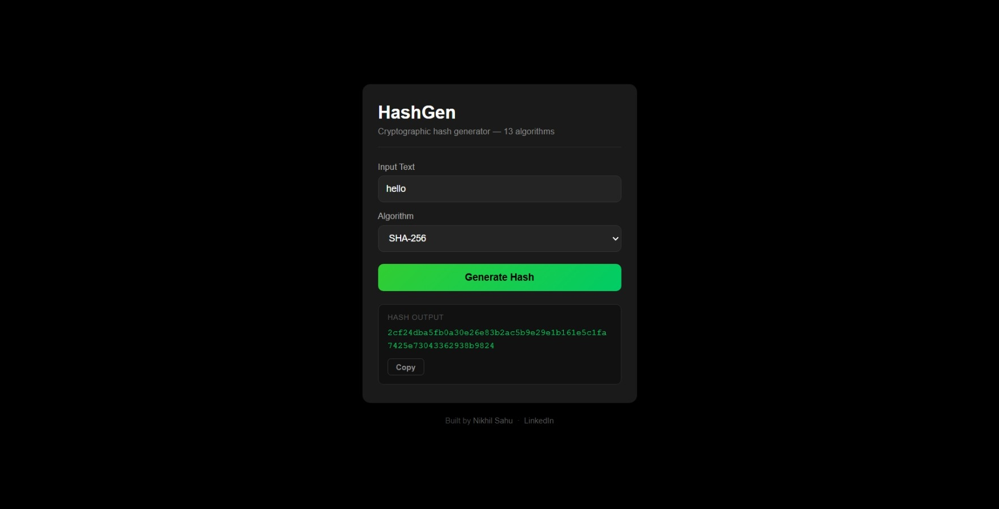

# HashGen — Cryptographic Hash Generator

A simple web-based tool to generate cryptographic hashes from text input. Built with Python and Flask, supports 13 hashing algorithms.

---

## Supported Algorithms

| Algorithm | Type |
|---|---|
| MD5 | Legacy — not recommended for security |
| SHA-1 | Legacy — known vulnerabilities |
| SHA-224 / SHA-256 / SHA-384 / SHA-512 | SHA-2 family |
| SHA3-224 / SHA3-256 / SHA3-384 / SHA3-512 | SHA-3 family |
| BLAKE2s / BLAKE2b | Fast and secure |
| SHAKE-128 | Extendable-output function |

---

## Features

- 13 hashing algorithms in one tool
- Clean, minimal UI
- Copy hash output with one click
- Input validation and error handling
- Deployable to Vercel

---

### Hashing


## Setup

```bash
git clone https://github.com/heynick1337/hashgen.git
cd hashgen
pip install -r requirements.txt
python app.py
```

Open `http://localhost:5000`

---

## Deploy to Vercel

The repo includes a `vercel.json` config for one-click Vercel deployment.

```bash
npm i -g vercel
vercel
```

---

## Project Structure

```
hashgen/
├── app.py              # Flask backend
├── requirements.txt
├── vercel.json         # Vercel deployment config
└── templates/
    └── index.html      # Frontend UI
```

---

## Author

**Nikhil Sahu**
- GitHub: [github.com/heynick1337](https://github.com/heynick1337)
- LinkedIn: [linkedin.com/in/sahunikhil01](https://linkedin.com/in/sahunikhil01)
